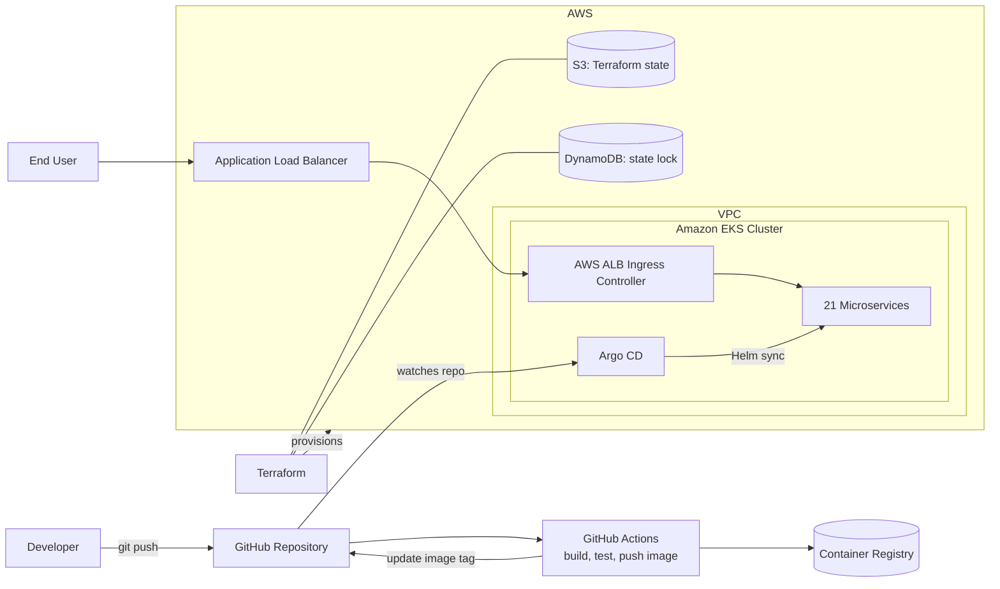

# CloudForge — Automated EKS Delivery Platform with Terraform & Argo CD

A cloud-native DevOps platform that provisions AWS infrastructure with **Terraform**, runs **21 Dockerized microservices** on **Amazon EKS**, and delivers them through a **GitOps pipeline** built on GitHub Actions, Helm, and Argo CD.


---

## Table of Contents

- [Overview](#overview)
- [Architecture](#architecture)
- [Key Features](#key-features)
- [Tech Stack](#tech-stack)
- [Repository Structure](#repository-structure)
- [Prerequisites](#prerequisites)
- [Getting Started](#getting-started)
- [CI/CD & GitOps Workflow](#cicd--gitops-workflow)
- [Security & Access Control](#security--access-control)
- [Docker Image Optimization](#docker-image-optimization)
- [Cleanup](#cleanup)
- [Acknowledgements](#acknowledgements)
- [License](#license)

---

## Overview

CloudForge covers the full path from infrastructure to running application:

1. **Infrastructure as Code**: Terraform provisions the VPC, EKS cluster, and IAM roles, with remote state in S3 and state locking in DynamoDB.
2. **Containerization**: 21 microservices are packaged with multi-stage Docker builds.
3. **Orchestration**: Workloads run on EKS and are managed with Helm charts.
4. **GitOps delivery**: GitHub Actions builds and pushes images, and Argo CD syncs the cluster to match the Git repository.
5. **Traffic management**: The AWS ALB Ingress Controller exposes services externally with path-based routing.

---

## Architecture



---

## Key Features

- **21 microservices** deployed on Amazon EKS for scalable, highly available workloads
- **Infrastructure as Code** with Terraform for the VPC, EKS, and IAM, plus remote state in S3 with DynamoDB locking
- **GitOps CI/CD** using GitHub Actions, Argo CD, and Helm
- **Least-privilege access** through RBAC and dedicated Service Accounts, with configuration kept in ConfigMaps and Secrets
- **AWS ALB Ingress Controller** for secure external access, path-based routing, and high availability
- **Optimized Docker images** from multi-stage builds (up to ~85% smaller)

---

## Tech Stack

| Category | Tools |
|---|---|
| Cloud | AWS (VPC, EKS, IAM, S3, DynamoDB, ALB) |
| Infrastructure as Code | Terraform |
| Containers | Docker (multi-stage builds) |
| Orchestration | Kubernetes, Helm |
| CI/CD | GitHub Actions |
| GitOps | Argo CD |
| Ingress | AWS Load Balancer (ALB) Ingress Controller |

---

## Repository Structure

```text
.
├── .github/workflows/   # GitHub Actions CI pipelines
├── kubernetes/          # Kubernetes / Helm manifests
├── src/                 # Microservices source code
├── pb/                  # Protobuf definitions
├── internal/tools/      # Internal tooling
├── test/                # Tests
├── docker-compose.yml   # Local run of all services
├── Makefile
└── README.md
```

> Update this tree to match your final layout (for example, add your `terraform/` and `argocd/` folders if they live in the repo).

---

## Prerequisites

- AWS account and AWS CLI configured (`aws configure`)
- [Terraform](https://developer.hashicorp.com/terraform/downloads) >= 1.5
- [kubectl](https://kubernetes.io/docs/tasks/tools/)
- [Helm](https://helm.sh/docs/intro/install/) >= 3
- [Docker](https://docs.docker.com/get-docker/)
- An S3 bucket and DynamoDB table for Terraform remote state

---

## Getting Started

### 1. Clone the repository

```bash
git clone https://github.com/shrikant-nidasheshi/End-to-End-Cloud-Native-DevOps-Platform.git
cd End-to-End-Cloud-Native-DevOps-Platform
```

### 2. Run locally with Docker Compose (optional)

```bash
docker compose up --build
```

### 3. Provision AWS infrastructure

```bash
cd terraform          # adjust to your Terraform directory
terraform init        # configures the S3 backend and DynamoDB lock
terraform plan
terraform apply
```

### 4. Connect kubectl to the EKS cluster

```bash
aws eks update-kubeconfig --region <your-region> --name <your-cluster-name>
kubectl get nodes
```

### 5. Install the AWS Load Balancer Controller

```bash
helm repo add eks https://aws.github.io/eks-charts
helm repo update
helm install aws-load-balancer-controller eks/aws-load-balancer-controller \
  -n kube-system \
  --set clusterName=<your-cluster-name> \
  --set serviceAccount.create=false \
  --set serviceAccount.name=aws-load-balancer-controller
```

### 6. Install Argo CD and deploy the applications

```bash
kubectl create namespace argocd
kubectl apply -n argocd -f https://raw.githubusercontent.com/argoproj/argo-cd/stable/manifests/install.yaml

# Get the initial admin password
kubectl -n argocd get secret argocd-initial-admin-secret \
  -o jsonpath="{.data.password}" | base64 -d

# Access the UI at https://localhost:8080
kubectl port-forward svc/argocd-server -n argocd 8080:443
```

Then apply your Argo CD `Application` manifest so it syncs the Helm charts from this repository.

### 7. Access the application

```bash
kubectl get ingress -A
```

Open the ALB DNS name shown in the `ADDRESS` column.

---

## CI/CD & GitOps Workflow

```text
Code push → GitHub Actions → Build image → Push to registry
                                   ↓
                 Update image tag in Helm values (Git)
                                   ↓
              Argo CD detects the change → Syncs to EKS
```

- **GitHub Actions** handles CI: building and pushing images and updating the deployment manifests.
- **Argo CD** handles CD: Git is the single source of truth, and the cluster is continuously reconciled to match it.
- **Helm** templates the Kubernetes resources for each service.

Benefits: automated deployments, easy rollbacks (revert a commit), and no manual `kubectl apply` in production.

---

## Security & Access Control

- **RBAC**: Roles and RoleBindings grant only the permissions each workload needs.
- **Service Accounts**: Workloads run under dedicated Service Accounts instead of the `default` one.
- **ConfigMaps & Secrets**: Configuration is kept out of container images.
- **IAM**: Terraform-managed roles follow least privilege.
- **Ingress**: External traffic enters only through the ALB, with routing rules defined per path.

---

## Docker Image Optimization

Multi-stage builds separate the build environment from the runtime image, so build tools and intermediate artifacts are not shipped.

| | Before | After |
|---|---|---|
| Image size (largest service) | ~700 MB | ~100 MB |

This cuts image size by up to ~85%, which speeds up image pulls and deployments.

---

## Cleanup

Avoid ongoing AWS charges by destroying resources when you are done:

```bash
kubectl delete ingress --all -A    # lets the controller remove the ALBs first
cd terraform
terraform destroy
```

---

## Acknowledgements

The microservice application code in `src/` is based on an open-source demo application. Credit goes to the original authors. <!-- Add the upstream project name and link here. -->

---

## License

This project is licensed under the Apache License 2.0. See [LICENSE](LICENSE) for details.

---

## Author

**Shrikant A N**
[GitHub](https://github.com/shrikant-nidasheshi) · [LinkedIn](https://www.linkedin.com/in/YOUR-LINKEDIN)
